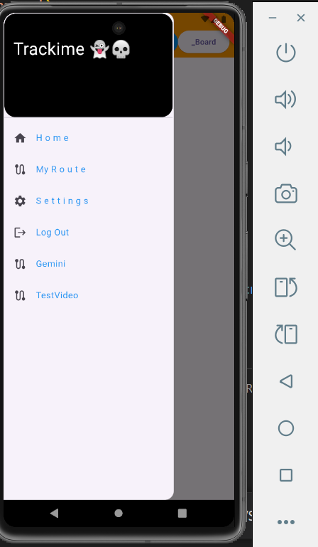

## Features  
- Track and save routes to revisit later.  
- View past routes when needed.  
- Retrieve historical information about a location using **latitude & longitude** (via **Gemini API**).  
- Secure and real-time data storage using **Firebase**.  
- Backend powered by **Node.js** for handling requests.  

## Tech Stack  
- **Flutter** (Frontend)  
- **Firebase** (Authentication & Database)  
- **Node.js** (Backend API)  
- **Gemini API** (Historical location data)

- ## Screenshots  
.png)  
  
